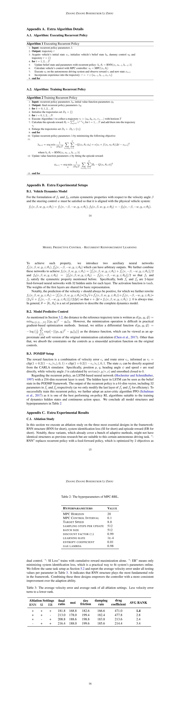

# mpc_rrl

> This is the codebase and supplementary material for "Incorporating Recurrent Reinforcement Learning into Model
Predictive Control for Faster Adaption in Autonomous Driving".

## Supplementary Material



## Code Structure

```bash
├── __init__.py
├── agents
│   ├── __init__.py
│   ├── custom_ppo.py
│   ├── custom_recurrent_ppo.py: MPC-RRL controller
│   ├── dummy.py: MPC controller
│   ├── online_estimation.py: MPC-OE controller
│   ├── system_id.py: vehicle model for system identification loss
├── configs
│   ├── agent: parameters of different agents
│   ├── overrides: parameters of different tasks
│   └── train.yaml
├── envs
│   ├── __init__.py
│   ├── carla: main entry of carla environment
├── logger.py
├── outputs: folder to save experimental results
├── requirements.txt
├── scripts: folder to run training/testing
├── test_ppo.py: script to test agents under environmental perturbations
├── train_ppo.py: script to train agents
├── utils.py: helper functions
└── video_ppo.py: script to render videos of the simulation process
```


## Execution Instructions 

### 1. Installation            

#### Conda Environment 
```bash
conda create -n carla python=3.8
pip install -r requirements.txt
```

#### CARLA Simulator
Download `carla-0.9.12 ` [here](https://github.com/carla-simulator/carla/releases) and put it into folder `$HOME/dl-tools`. 


### 2. Instructions

### Training

Train on GPU machine,
```
bash scripts/train_ppo.sh 
```

### Testing

The test is executed on 3 values per parameter (e.g. moi, drag_coefficient...). Each value is tested with 100 episodes. 

Test on GPU machine,
```
bash scripts/test_ppo.sh 
```
For testing on GPUs, Carla should be manually shut down by running `bash scripts/kill_carla.sh`.

